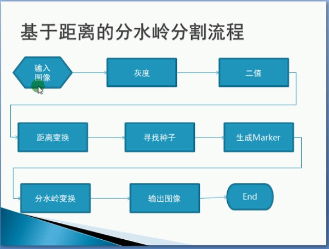
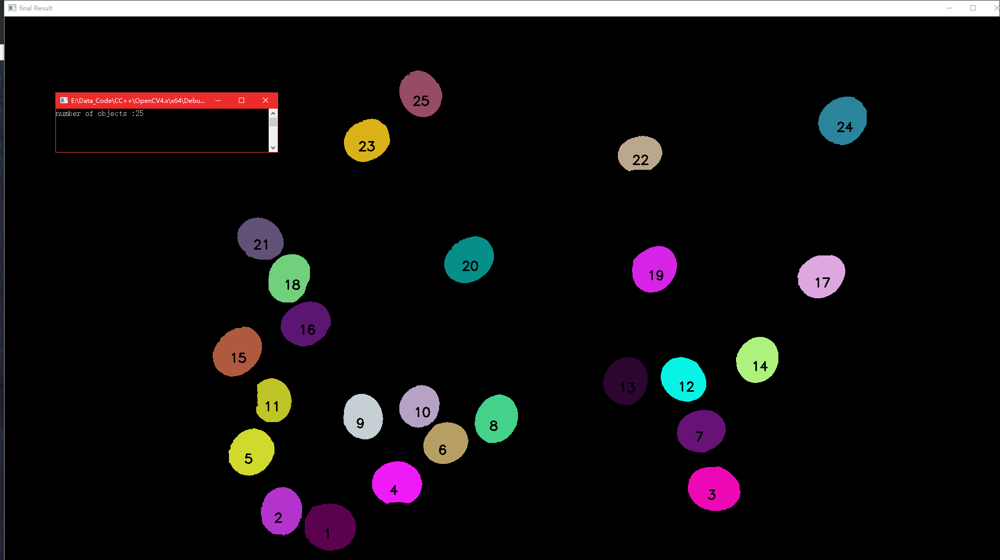

# watershed
C++， 实现分水岭代码  

# Enviornment
Version: OpenCV 4.1.0  

OS: Windows 10  

Editor: Visual Studio 2019  

# Comment 
1、**VS 2019 配置OpenCV 教程见：** https://blog.csdn.net/weixin_41288824/article/details/96509189  

2、**视频教程** ：https://www.bilibili.com/video/av32240354/?p=7  第7，8，9节课程  

# Process

# Run Out

